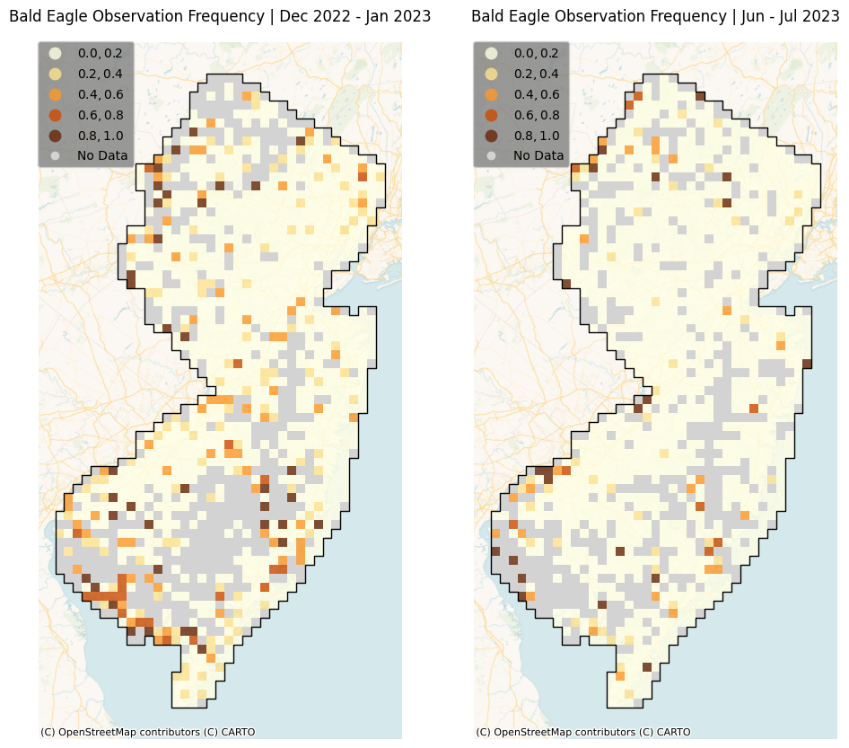

# Bald Eagle Wintering in New Jersey

*Created by Jason Kawalec for the Spring 2024 semester of Command-Line GIS at the Edward J. Bloustein School of Planning and Public Policy, Rutgers University.*

While New Jersey is home to a small population of bald eagles that nest year-round, it is the winter when their numbers increase significantly as migrating eagles from the northern states and Canada move to NJ in search of open water and abundant food sources. This is known as **bald eagle wintering**. I was interested in researching how the spatial distribution of bald eagle wintering in NJ could be visualized through reports from [eBird](https://ebird.org/about), an online platform and global citizen science project managed by the Cornell Lab of Ornithology in collaboration with the National Audubon Society. On eBird, birdwatchers record their bird observations on checklists and contribute data to a centralized database. 

This project uses four months—December 2022 to January 2023 and June to July 2023—of verified bald eagle observations and eBird checklists provided by the Cornell Lab of Ornithology as text files via the eBird Basic Dataset. Only one checklist was preserved per group checklist. 

Bald eagle observations represent only the **presence** of bald eagles. Therefore, to also represent the **absence** of bald eagles, all NJ checklists that excluded bald eagle observations were joined with bald eagle observations. Following a spatial join of presence-absence checklists with 5 kilometer x 5 kilometer grid cells and New Jersey's level III ecoregions, the frequency of bald eagle observations per eBird checklist can be represented at these scales. These could be considered a proxy for bald eagle species abundance during summer and winter in NJ. 

## Frequency of Bald Eagle Reports on eBird in Winter 2022-2023 and Summer 2023

In the following two maps, a **frequency value of 0** indicates that no bald eagles were reported in all eBird checklists within the 5km x 5km cell while a **frequency value of 1** indicates that at least one bald eagle was observed in all eBird checklists within the cell. All No Data cells indicate that there were no eBird checklists reported in the cell.

## Interactive Map of Bald Eagle Observations Over Time

The interactive map presents a heat map time lapse of bald eagle observations per day for both the winter and summer months. The observation frequency of bald eagles per level III ecoregion in NJ [(provided as a shapefile by the Environmental Protection Agency)](http://ecologicalregions.info/htm/nj_eco.htm) can be enabled. The ten localities containing the ten highest counts of bald eagles reported in NJ during the four months are displayed for context. 

<iframe src="bald_eagle_wintering_nj.html" height="855" width="95%"></iframe>

You can explore this map [as its own web page here.](bald_eagle_wintering_nj.html)
